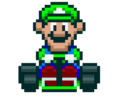

<h1>Node Kart.JS</h1>

<table>
  <thead>
    <tr>
      <th>Jogadores</th>
      <th>Objetivo</th>
    </tr>
  </thead>
  <tbody>
    <tr>
      <td>
        
      </td>
      <td>
        Criação de um sistema utilizando como tecnologia o Javascript com NodeJS para simular corridas de Mario Kart, levando em consideração as regras e mecanicas a seguir.
      </td>
    </tr>
  </tbody>
</table>

---

<h2>Regras de negócio</h2>

1. O computador selecionara automaticamente 2 (dois) pesonagens para disputar a corrida
   - O computador não pode selecionar os 2 jogadores sendo o mesmo personagem
2. Quando a corrida iniciar os jogadores devem correr em pistas aleatorias em 5 rodadas
   - O jogador deve jogar um dado de 6 lados
   - Caso a pista seja do tipo `RETA` somar o valor retirado no dado com o atributo `velocidade` do personagem.
   - Caso a pista seja do tipo `CURVA` somar o valor retirado no dado com o atributo `manobrabilidade` do personagem.
   - Caso a pista seja do tipo `CONFRONTO` somar o valor retirado no dado com o atributo `poder` do personagem.
3. Em caso do tipo de pista `CONFRONTO`
   - Caso o tipo de confronto seja `CASCO`
     - O perdedor deve peder 1 ponto
   - Caso o tipo de confronto seja `BOMBA`
     - O perdedor deve peder 2 pontos
4. Ao final de cada rodada
   - O ganhador deve ganhar 1 (um) ponto
   - Em caso de empate nenhum dos jogadores ganham pontos
5. Nenhum jogador pode ter a pontuação negativa
6. O jogador que mais pontuar será quem ganhou a corrida

<h2>Jogadores disponiveis</h2>

<table>
  <thead>
    <tr>
      <th>Jogador</th>
      <th>Nome</th>
      <th>Status</th>
    </tr>
  </thead>

  <tbody>
    <tr>
      <td>
        
      </td>
      <td>
        Mario
      </td>
      <td>
        

          
Velocidade: 4

          
Manobrabilidade: 5

          
Poder: 3

        

      </td>
    </tr>
    <tr>
      <td>
        
      </td>
      <td>
        Peach
      </td>
      <td>
        

          
Velocidade: 3

          
Manobrabilidade: 4

          
Poder: 2

        

      </td>
    </tr>
    <tr>
      <td>
        
      </td>
      <td>
        Yoshi
      </td>
      <td>
        

          
Velocidade: 2

          
Manobrabilidade: 4

          
Poder: 3

        

      </td>
    </tr>
    <tr>
      <td>
        
      </td>
      <td>
        Bowser
      </td>
      <td>
        

          
Velocidade: 5

          
Manobrabilidade: 2

          
Poder: 5

        

      </td>
    </tr>
    <tr>
      <td>
        
      </td>
      <td>
        Luigi
      </td>
      <td>
        

          
Velocidade: 3

          
Manobrabilidade: 4

          
Poder: 4

        

      </td>
    </tr>
    <tr>
      <td>
        
      </td>
      <td>
        Donkey Kong
      </td>
      <td>
        

          
Velocidade: 2

          
Manobrabilidade: 2

          
Poder: 5

        

      </td>
    </tr>
  </tbody>
</table>
